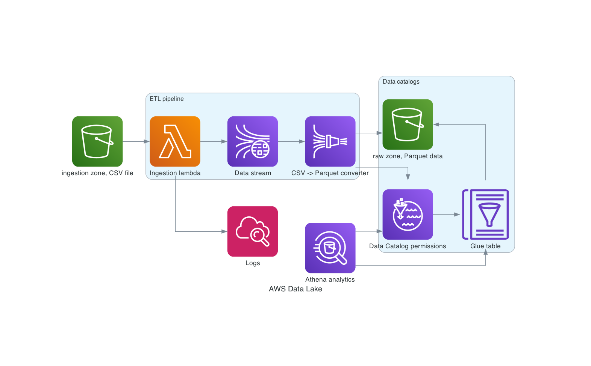

# AWS Data Lake example

## Diagram

## Terraform workspaces structure

### persistance

This layer is extracted from `datalake` workspace to preserve data when refactoring serverless infrastructure.

### iam

IAM users and roles can be set before set up of the data lake infrastructure.

### datalake

This infrastructure is making the majority of the billing costs and can be deleted and restored anytime.

## TODO

* Cleaning the code
* Extracting code from workspaces' main.tf files to modules
* Versioning of modules through git tags
